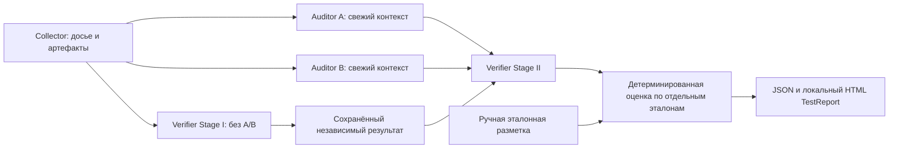

# Испытательный контур v0.5

Контур использует существующие `collect`, `analyze`, `start` и `finish`:



Gateway не вызывается. Нет отправки сообщений, коммерческих предложений, автоматического
GO или вывода о полном юридическом соответствии. Нормы остаются `unverified`: поля JSON,
официальный URL, локальный SHA-256 и самозаявленная аттестация не удостоверяют происхождение.

## Три режима

**Synthetic**: 19 локальных сценариев в `tests/benchmarks`. Реальный Collector и Playwright
обрабатывают байты из транспортной фикстуры, которая разрешает только
`https://benchmark.example/` и вообще не открывает сетевые соединения. Используются реальные
HTML/скриншоты и созданные локально PDF. JavaScript, внешние ресурсы и отправка форм отключены
по правилам v0.2. Только в синтетическом стенде ошибка скриншота внедряется через mock.
Производственная SSRF-политика не меняется. A/B и Verifier получают записанные ответы,
а затем проходят существующую нормализацию, проверку цитат, ссылок, PDF и Stage I/II.

**Offline replay**: повторная обработка уже собранного `dossier/` и записанных ответов без
Collector, API-ключей и сетевых вызовов. Артефакты проверяются существующим `load_packet`,
в выходное досье копируются только проверенные файлы, на которые ссылается манифест; копия
проверяется снова. Нет автоматической отправки записанного пакета провайдеру. Отсутствующие,
изменённые или небезопасные артефакты дают провал испытания, а не успешное пустое заключение.

**Controlled pilot**: выключенный по умолчанию сбор одного публичного сайта, максимум
10 страниц и 10 документов. Нужны отдельное включение, CLI-разрешение и подтверждение точного
SHA-256 конфигурации. Он вызывает только существующий Collector с его DNS pinning, SSRF,
контролем редиректов, таймаутами и ограничениями файлов. Ни LLM, ни формы, ни авторизация
не запускаются. Во время разработки публичные сайты и платные запросы не проверялись.

## Эталонная разметка

Каждый каталог сценария содержит:

- `site.json`: синтетические HTML-маршруты, HTTP-ошибки и описание страниц PDF;
- `responses.json`: сохранённые ответы A, B, blind Stage I и comparison Stage II;
- `registry.json`: только непроверенные нормативные записи;
- `reference.json`: независимые экспертные ожидания.

Эталон содержит описание ситуации, структурированные наблюдения, устойчивые ID проблем,
`topic`, `claim_code`, точный набор `evidence_ids`, положительную/отрицательную метку,
основание разметки, допустимые гипотезы, запрещённые выводы, нормативные ссылки и их статус,
ожидаемые ограничения, допустимые итоговые статусы и полный ожидаемый набор страниц материалов.
Положительная метка означает **существенную гипотезу для проверки**, а не подтверждённое
нарушение. Отрицательная метка включает недоказанные обвинения по техническим признакам.

Ответы провайдеров не получают `reference.json` и не строятся из эталона во время испытания.
Они намеренно содержат завышенное подтверждение, неверного оператора, устаревшую ссылку,
неприменимое требование, смешанный PDF, спор A/B и пропуск цены. Эталоны не должны содержать
реальные ПДн. Условно корректная политика корректна только в заданном синтетическом объёме.

Сопоставление: нормализованные `topic` и `claim_code`, точный отсортированный набор evidence ID.
Текстовое сходство не используется. Точные дубликаты A/B объединяются по существующим правилам;
совпадающий независимый вывод объединяется только при одинаковом факте, утверждении,
интерпретации, позиции и конечном статусе. Несколько возможных соответствий идут в ручную
проверку и не дают TP. ID исходных находок и исходные A/B-результаты сохраняются в этапных файлах.

## Метрики и слои

Пусть TP — однозначно обнаруженная положительная эталонная гипотеза; FN — необнаруженная
или неоднозначная положительная гипотеза; FP — заявленная отрицательная гипотеза;
TN — отрицательный эталон без однозначно принятой гипотезы. Повторные находки не увеличивают TP.
Внеэталонное положительное утверждение учитывается отдельно как `extra_fp`, ухудшает Precision
и обязательно направляется эксперту. Оно не создаёт искусственную отрицательную единицу FPR.
Метрики действуют лишь в конечном размеченном пространстве, а не на всем интернете.

| Метрика | Числитель / знаменатель |
| --- | --- |
| Precision | TP / (TP + FP + extra_fp) |
| Recall | TP / (TP + FN) |
| False Positive Rate | FP / (FP + TN) |
| False Negative Rate | FN / (FN + TP) |
| Evidence Coverage | Доступные проверенные evidence ID / ожидаемые evidence ID |
| Normative Verification Coverage | Доверенно актуальные ссылки / размеченные нормативные ссылки |
| Operator Identification Accuracy | Точное соответствие operator_ref эталону / размеченные проверки оператора |
| Completeness of Material Review | Признанные проверенными доступные текстовые страницы / все ожидаемые страницы |
| Disagreement Resolution Rate | Разрешённые однозначным доказательным исходом споры / размеченные споры |

Суммы числителей и знаменателей агрегируются по случаям, проценты не усредняются.
Нулевой знаменатель возвращает `value: null, status: not_applicable`.
Неразрешённое сопоставление всегда видно в ручных проверках; отрицательные неопределённые
случаи нельзя интерпретировать как экспертное опровержение. FPR — доля принятых гипотез
на отрицательных эталонах, не оценка уверенности в каждом результате.

Отдельно выводятся:

- `factual_detection`: доля положительных эталонов с буквальной привязкой к действительно
  доступному и отмеченному прочитанным тексту; совпадение цитаты не доказывает её истинность;
- `applicability_accuracy`: точное соответствие применимости эталонной метке;
- `confirmed_legal_recall`: доля положительных эталонов, получивших подтверждённый правовой
  статус. Сейчас она нулевая, поскольку доверенная аттестация норм недоступна.

Ошибочная гипотеза со статусом `potential_issue` остаётся FP; запрет её подтверждения
не превращает её в правильное юридическое заключение. Различаются факт, квалификация,
проверка нормы, применимость и конечные quality gates. При этом нет установленного
порогового процента качества: малый синтетический набор нерепрезентативен.

## Запуск offline benchmark

```bash
python -m pip install -e '.[dev]'
python -m playwright install chromium
lexradar benchmark --suite tests/benchmarks --output work/benchmark
lexradar quality-report work/benchmark --format html
```

Выходной каталог должен быть новым. `test-report.json` и `test-report.html` включают метрики,
PASS/FAIL, найденные/пропущенные проблемы, FP с причинами, ручные проверки, локальные ссылки
на артефакты, хеши эталонов/ответов/досье, модели и версии/хеши промптов, расходы и ограничения.
HTML экранирует недоверенные строки, не содержит JS/внешних ресурсов и защищён CSP.
Оригинальный HTML предлагается скачать: это недоверенный артефакт. Скриншоты помечены как
изолированные, с отключёнными JavaScript и внешними ресурсами; живой сайт не воспроизводится точно.

Статусы испытаний: `failed` при провале защитного правила/этапа, иначе
`manual_review_required` при FP, FN или неоднозначности, иначе `passed`.
CLI возвращает код 1 для `failed`; необходимость ручной проверки — отдельный успешный
технический исход, который **не** означает готовность к обращению к клиенту.

Offline replay использует такой же набор каталогов, но вместо `site.json` — сохранённый
`dossier/collection.json` с артефактами. `responses.json` должен содержать JSON-ответы всех четырёх
этапов для именно этого досье; ответы повторно валидируются. Это не повторная генерация LLM.

```bash
lexradar benchmark --mode replay --suite work/replay-suite --output work/replay-result
```

Встроенные `offline/*` — имена стенда, а не версии реально вызванных моделей. Расход текущего
offline-запуска равен нулю; стоимость исходной записи неизвестна без отдельной разметки.

## Controlled pilot: локальная подготовка и ручное продолжение

`examples/pilot-config.json` выключен. Перед реальным сбором человек должен проверить точную
конфигурацию, публичность URL и пределы и заполнить `approval.config_sha256` из
`PilotConfig.binding_sha256()`; хеш включает enabled, URL, все лимиты и предел расходов.
Любое изменение требует нового подтверждения. Общего флага недостаточно.

```bash
lexradar pilot --config work/pilot.json --output work/pilot-run --allow-public-collection
```

Не запускайте пример до проверки URL и отдельного разрешения. `runs.jsonl` записывает запрос,
отказ/начало/ошибку/завершение каждого запуска с валидной конфигурацией, хешом и нулевым расходом
LLM. Повторный запуск требует нового выходного каталога. На этом этапе API вообще не вызывается,
поэтому расход controlled pilot всегда 0; допустимый будущий бюджет максимум 1 USD записывается
в конфигурацию, но не является лимитом аккаунта OpenRouter.

Дальнейшая отправка — **отдельные ручные действия** через существующие v0.3/v0.4 команды:

1. `preflight` для A/B, проверка содержимого, отдельный точный SHA-256 approval.
2. `analyze --mode openrouter --allow-external-transfer --packet-approval ...` с явным бюджетом.
3. `verify-preflight` для blind Stage I, новый preflight и утверждение другого хеша;
   затем `verify --mode openrouter ...`.
4. После сохранения Stage I — `verify-preflight --stage-one ... --analysis ...`, новый
   preflight и утверждение Stage II; затем `verify-compare --mode openrouter ...`.

Каждая команда требует собственной конфигурации и разрешения. Общий бюджет всех вручную
запускаемых этапов нужно распределить заранее; бюджеты A/B и Verifier не составляют один
автоматический аккаунтный лимит. Стенд не разрешает эти шаги за пользователя. В пакетах с
признаками чувствительных ПДн передача блокируется даже при наличии approval. Автоматическое
выявление ПДн не гарантирует их отсутствие. Журналы этапов находятся в их выходных каталогах.

## Экспертная разметка

JSON-массив `ExpertLabel` связывает `report_sha256` (точный SHA-256 байтов `test-report.json`),
`dossier_sha256`, `case_id`, `finding_id`, проверяющего, время, статус и обоснование.
Статусы: `expert_confirmed`, `erroneous_finding`, `additional_review_required`,
`unrelated_operator`, `inapplicable_norm`, `insufficient_evidence`.

```bash
lexradar quality-report work/benchmark --format html --expert-labels work/expert-labels.json
```

При изменении отчёта или досье старые метки отвергаются. Метки отображаются отдельно, не меняют
эталонные метрики, правовую норму или Gateway. `authenticated` всегда false: это workflow
самозаявленного human review, без удостоверения личности или криптографического доверия.

## Расширение и ограничения

Добавляйте отдельно сайт/досье, записанные ответы и эталон. Сохраняйте устойчивые идентификаторы,
отрицательные контрольные случаи, основания разметки и реальный знаменатель полноты. Размечайте
провалы и пропуски; не переименовывайте гипотезу в подтверждённое нарушение. Для репрезентативной
оценки нужны независимые эксперты, больше сайтов, разные клиники/операторы, официальные редакции
норм и реальные ответы разных моделей с зарегистрированными версиями и расходами.

Стенд проверяет интеграцию, арифметику и защитные правила. Он не доказывает способность LLM
найти проблему, качество юридической аргументации, независимость разных моделей, полноту
живого JS-сайта, правильность идентификации оператора, подлинность нормы или отсутствие ПДн.
OCR, визуальная проверка PDF, аутентифицированный эксперт и доверенная аттестация источников
не реализованы. Реальный пилот и любые платные испытания требуют отдельных разрешений.

Для replay можно добавить `metadata.json` с `models`, `prompts` и
`original_api_cost_usd`. Они отображаются отдельно от имён стенда и нулевого расхода повторного
запуска, связаны хешем исходного файла и обозначены как самозаявленные метаданные записи.
Без них версии и расходы оригинальных запросов неизвестны. Эту информацию нельзя считать
удостоверенной провайдером или использовать для подтверждения нормы.
